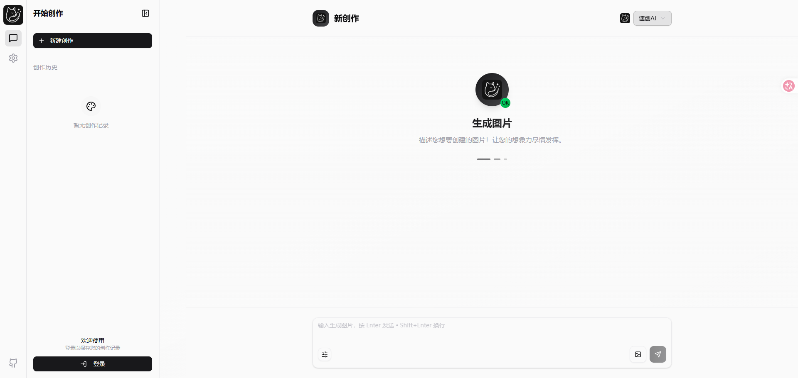
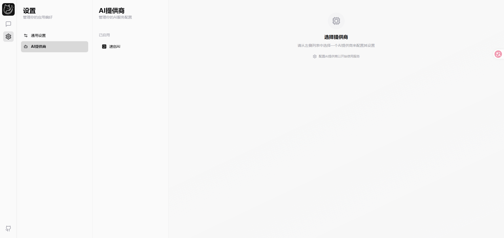

# ai-image-studio · 速创AI 图像生成

<p align="center">
  
  
  
  
  
</p>

一个基于 **速创AI** 国内生图服务的 AI 图像生成工具，日常自用：输入一句话，生成一张图。

基于开源项目二次开发，深度改造了后端 provider 层，接入速创AI 生图能力，并适配 Cloudflare Pages + Workers 自托管部署。

**Live**：[typix-frontend.pages.dev/chat](https://typix-frontend.pages.dev/chat)

## ✨ 特性

- 🖼️ **AI 生图**：基于速创AI，输入描述即出图，日常自用
- ☁️ **Cloudflare 自托管**：前端 Pages + 后端 Workers（D1 + R2），完全掌控数据
- 🤖 **可插拔 provider**：后端 provider 接口统一，可继续接入更多生图服务
- 🔄 **云同步**：登录后多设备同步创作记录
- 🌐 **国际化**：中文 / 英文

## 架构

```
[浏览器前端 React SPA]  ──HTTP──>  [Cloudflare Workers 后端]
                                        │
                                  ┌─────┴──────┐
                                  │ D1 数据库   │ 创作记录 / 用户
                                  │ R2 存储     │ 生成的图片
                                  │ 速创AI      │ 生图推理
                                  └─────────────┘
```

## 界面预览

**创作对话** — 输入一句描述，按 Enter 即生成图片；支持速创AI 提供商切换与创作历史管理。

<p align="center">
  
</p>

**AI 提供商设置** — 可插拔的 provider 配置页，管理速创AI 等服务接入。

<p align="center">
  
</p>

## 二次开发说明

- **接入速创AI provider**：后端新增 `suchuang` provider，实现统一生图接口（见 `worker/src/providers/suchuang.ts`）
- **前端适配**：新增速创AI 提供商配置（`src/app/ai/provider/index.ts`）
- **部署改造**：后端重构为 Cloudflare Workers（`worker/`），支持 D1 + R2 + Pages 全栈部署
- **快捷部署脚本**：`pnpm deploy:worker` / `pnpm deploy:frontend`

## 🚀 部署（Cloudflare）

### 前置要求

- Cloudflare 账号（已启用 R2 存储）
- Node.js 20+ / pnpm

### 步骤

```bash
# 1. 克隆并安装
pnpm install

# 2. 登录 Wrangler
npx wrangler login

# 3. 创建 D1 数据库和 R2 存储桶
npx wrangler d1 create typix-db
npx wrangler r2 bucket create typix-images

# 4. 将 D1 database_id 填入 worker/wrangler.toml（顶层和 [env.production] 两处）

# 5. 设置密钥
npx wrangler secret put JWT_SECRET --config worker/wrangler.toml --env production
npx wrangler secret put SUCHUANG_API_KEY --config worker/wrangler.toml --env production

# 6. 数据库迁移
pnpm db:migrate

# 7. 部署后端 + 前端
pnpm deploy:worker
pnpm deploy:frontend
```

## 开发

```bash
pnpm dev          # 本地前端开发
pnpm lint         # biome lint
```

## License

Apache 2.0，见 [LICENSE](LICENSE)。
