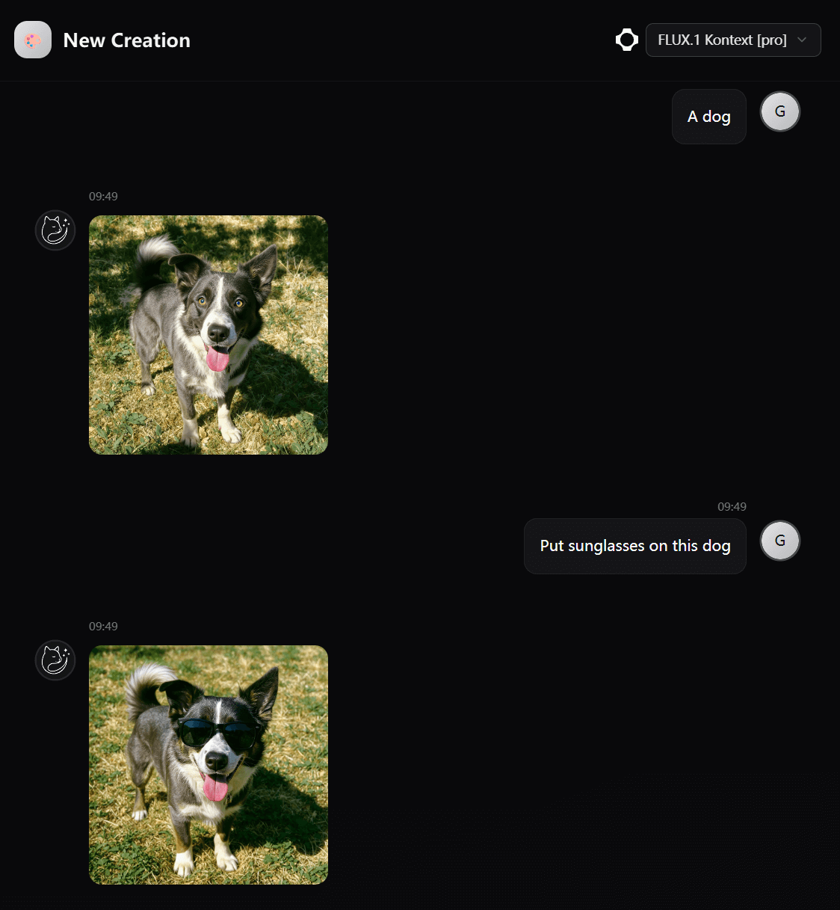

# Typix - Type To Pixels

<p align="center">
  <a href="https://github.com/monkeyWie/typix/releases"></a>
  <a href="https://www.apache.org/licenses/LICENSE-2.0"></a>
</p>

<p align="center"><a href="README.md">简体中文</a> | English</p>

Typix is a modern, open-source, and user-friendly AI image generation tool, providing creators with a one-stop AI image generation experience. Built on a frontend SPA + Cloudflare Workers architecture with self-hosting support.



## 🎯 Quick Start

No registration required — start generating AI images immediately.

- [https://typix.art](https://typix.art)
  Production-grade stable version with cloud sync support
- [https://preview.typix.art](https://preview.typix.art)
  Get early access to the latest features and improvements

## ✨ Core Features

Focused on AI image generation, turning creativity into visual art instantly

- 🏠 **Self-hosted** - Full control over your data and privacy
- 🎁 **Free & Open Source** - Apache 2.0 licensed, free to use and modify
- ☁️ **Cloudflare Deployment** - Deploy to Cloudflare Workers with ease
- 🤖 **Multi-model Support** - Connect to various AI models via provider configuration
- 🔄 **Cloud Sync** - Sync your content across devices with account login
- 🌐 **Internationalization** - Supports Chinese and English

## 🚀 Deployment

### Cloudflare Workers Deployment (Recommended)

#### Prerequisites

- [Cloudflare account](https://dash.cloudflare.com)
- Node.js 20+
- pnpm

#### Steps

1. **Create resources in Cloudflare Dashboard**

   - Create a **D1** database named `typix-db`
   - Create an **R2** bucket named `typix-images`
   - Fill in the D1 `database_id` in `worker/wrangler.toml`

2. **Clone and install dependencies**

```bash
git clone https://github.com/monkeyWie/typix.git
cd typix
pnpm install
```

3. **Configure environment variables**

```bash
cp worker/.dev.vars.example worker/.dev.vars
# Edit worker/.dev.vars with your JWT_SECRET and SUCHUANG_API_KEY
```

4. **Run database migration**

```bash
cd worker
pnpm db:migrate
```

5. **Deploy Worker**

```bash
cd worker
pnpm deploy
```

6. **Deploy frontend static assets**

Deploy the `dist/` directory to Cloudflare Pages or any static hosting service, and set the `VITE_WORKER_URL` environment variable to point to your Worker address.

### Static File Hosting (frontend only, using remote API)

If you only need to deploy the frontend while using a remote Worker API:

```bash
pnpm install
pnpm build
# Deploy dist/ to Cloudflare Pages / Vercel / Netlify / etc.
```

Specify the Worker URL at build time:

```bash
VITE_WORKER_URL=https://your-worker.workers.dev pnpm build
```

## 🛠️ Development Documentation

### Tech Stack

**Frontend:**

- **React 19** - Modern UI framework
- **TypeScript** - Type-safe JavaScript
- **Tailwind CSS v4** - Atomic CSS framework
- **shadcn/ui** - High-quality UI component library
- **TanStack Router** - Type-safe routing management
- **Zustand** - Lightweight state management
- **SWR** - Data fetching and caching
- **react-i18next** - Internationalization

**Backend (Cloudflare Worker):**

- **Hono** - Lightweight web framework
- **Cloudflare D1** - Serverless SQLite database
- **Cloudflare R2** - Object storage
- **Drizzle ORM** - Type-safe ORM
- **Jose** - JWT authentication

**Development Tools:**

- **Vite** - Fast build tool
- **Biome** - Code formatting and linting
- **pnpm** - Package manager (workspace mode)
- **Wrangler** - Cloudflare Workers CLI

### Local Development Guide

#### Environment Setup

1. **Install Node.js 20+**
2. **Install pnpm**

```bash
npm install -g pnpm
```

#### Development Workflow

1. **Clone the project**

```bash
git clone https://github.com/monkeyWie/typix.git
cd typix
```

2. **Install dependencies**

```bash
pnpm install
```

3. **Configure Worker environment variables**

```bash
cp worker/.dev.vars.example worker/.dev.vars
# Edit worker/.dev.vars with your actual SUCHUANG_API_KEY
```

4. **Initialize local database**

```bash
cd worker
pnpm db:migrate:local
cd ..
```

5. **Start development servers** (requires two terminals)

```bash
# Terminal 1: Start Worker backend (default http://localhost:8787)
cd worker && pnpm dev

# Terminal 2: Start frontend dev server (default http://localhost:5173)
pnpm dev
```

The frontend will automatically connect to the local Worker via `VITE_WORKER_URL` (defaults to `http://localhost:8787`).

#### Project Structure

```
├── src/app/                # Frontend SPA
│   ├── ai/                 # AI provider type definitions
│   ├── components/         # React components
│   │   ├── icon/           # Icon components
│   │   ├── login/          # Login components
│   │   ├── navigation/     # Navigation components
│   │   └── ui/             # shadcn/ui components
│   ├── hooks/              # Custom Hooks
│   ├── i18n/               # i18n config and language files
│   ├── lib/                # Utility libraries and API client
│   ├── routes/             # Route pages
│   │   ├── chat/           # Chat page
│   │   └── settings/       # Settings page
│   └── stores/             # Zustand state management
├── worker/                 # Cloudflare Worker backend
│   ├── src/
│   │   ├── index.ts        # Hono app entry point
│   │   ├── auth/           # JWT authentication
│   │   ├── db/             # Database schema and instance
│   │   ├── providers/      # Image generation providers
│   │   └── routes/         # API routes
│   ├── drizzle/            # Database migration files
│   └── wrangler.toml       # Worker configuration
├── docs/                   # Documentation site
└── public/                 # Static assets
```

## 📄 License

This project is licensed under the [Apache License 2.0](https://www.apache.org/licenses/LICENSE-2.0).

You are free to:

- ✅ Commercial use
- ✅ Modify the code
- ✅ Distribute the project
- ✅ Private use

But you must:

- 📝 Include copyright notice
- 📝 Include the license file
- 📝 State significant changes

---

If this project helps you, please consider giving us a ⭐ Star!
